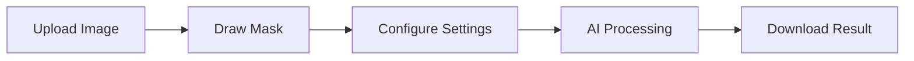

# 🎨 AI Image Inpainting Studio

<div align="center">


**Professional AI-Powered Image Inpainting Application**

[Features](#-features) • [Quick Start](#-quick-start) • [Documentation](#-documentation) • [Demo](#-demo)

</div>

---

## ✨ Features

### 🎯 Core Features
- **AI-Powered Inpainting** - Remove unwanted objects intelligently using GAN technology
- **Interactive Mask Drawing** - Draw directly on images with custom canvas tools
- **4-Step Workflow** - Upload → Mask → Configure → Result
- **History Tracking** - Keep last 10 inpainting jobs with thumbnails
- **Real-time Preview** - See original and masked images side-by-side

### 🎨 UI/UX Features
- **Dark/Light Mode** - Toggle between themes with smooth transitions
- **Fully Responsive** - Perfect on mobile, tablet, and desktop
- **100vh Layout** - Everything fits in viewport, no scrolling
- **Professional Design** - Clean, modern interface with consistent theming
- **Smooth Animations** - Polished transitions and hover effects
- **Accessibility** - WCAG compliant with keyboard navigation

### 🚀 Technical Features
- **Production Ready** - Optimized for deployment
- **Environment Config** - Easy configuration with .env files
- **API Integration** - RESTful backend with Django
- **Fast Processing** - Optimized GAN model
- **Error Handling** - Graceful error messages
- **Type Safety** - PropTypes validation

---

## 🎨 Screenshots

### Light Mode
```
┌─────────────────────────────────────────────────────────┐
│  AI Image Inpainting Studio          ☀️  + New          │
├─────────────────────────────────────────────────────────┤
│  ● Step 1: Upload Image          ① ② ③ ④               │
│  ┌───────────────────────────────────────────────────┐  │
│  │                                                     │  │
│  │         📁 Drag & Drop or Click to Upload          │  │
│  │                                                     │  │
│  └───────────────────────────────────────────────────┘  │
│  💡 Quick Tip: Upload JPG, PNG, or WebP (max 10MB)     │
└─────────────────────────────────────────────────────────┘
```

### Dark Mode
```
┌─────────────────────────────────────────────────────────┐
│  AI Image Inpainting Studio          🌙  + New          │
├─────────────────────────────────────────────────────────┤
│  ● Step 2: Draw Mask             ✓ ② ③ ④               │
│  ┌───────────────────────────────────────────────────┐  │
│  │                                                     │  │
│  │         [Canvas with Image and Mask Tools]         │  │
│  │                                                     │  │
│  └───────────────────────────────────────────────────┘  │
│           [Cancel]  [Next Step →]                       │
└─────────────────────────────────────────────────────────┘
```

---

## 🚀 Quick Start

### Prerequisites
- **Node.js** 16+ 
- **Python** 3.8+
- **npm** or **yarn**

### Installation

**1. Clone the repository**
```bash
git clone <repository-url>
cd Image_Inpainting_Using_Enhanced-U-Net_and_Adversarial_Learning
```

**2. Backend Setup**
```bash
cd img_backend
python -m venv .venv
.venv\Scripts\activate  # Windows
# source .venv/bin/activate  # Linux/Mac

pip install -r requirements.txt
cp .env.example .env
python manage.py migrate
```

**3. Frontend Setup**
```bash
cd img_frontend
npm install
cp .env.example .env
```

**4. Run Development Servers**

**Backend:**
```bash
cd img_backend
.venv\Scripts\activate
python manage.py runserver
```
✅ Backend: `http://localhost:8000`

**Frontend:**
```bash
cd img_frontend
npm run dev
```
✅ Frontend: `http://localhost:5173`

---

## 📖 Documentation

| Document | Description |
|----------|-------------|
| [QUICKSTART.md](QUICKSTART.md) | Complete setup and usage guide |
| [DEPLOYMENT.md](DEPLOYMENT.md) | Production deployment instructions |
| [FINAL_SUMMARY.md](FINAL_SUMMARY.md) | Comprehensive project summary |
| [API.md](API.md) | API documentation |

---

## 🏗️ Tech Stack

### Frontend
- **React 18.2** - UI library
- **Vite 7.2** - Build tool & dev server
- **Tailwind CSS 4.1** - Utility-first CSS
- **Axios** - HTTP client
- **Fabric.js** - Canvas manipulation
- **Framer Motion** - Smooth animations ✨
- **React Hot Toast** - Beautiful notifications ✨
- **Lucide React** - Modern icons ✨

### Backend
- **Django 5.1** - Web framework
- **Django REST Framework** - API
- **PyTorch** - Deep learning
- **PIL/Pillow** - Image processing
- **Gunicorn** - Production server
- **WhiteNoise** - Static file serving

### AI Model
- **Enhanced U-Net** - Generator architecture
- **GAN** - Generative Adversarial Network
- **PyTorch** - Model implementation

---

## 🎯 How It Works



1. **Upload** - Select your image (JPG/PNG/WebP, max 10MB)
2. **Mask** - Draw over objects you want to remove
3. **Configure** - Set iteration count (1-5) for quality
4. **Process** - AI intelligently fills masked areas
5. **Download** - Get your perfected image

---

## 🎨 UI Components

### Available Components

```jsx
// Button
<Button variant="primary" size="md" onClick={handleClick}>
  Click Me
</Button>

// Card
<Card elevated>
  <h3>Title</h3>
  <p>Content</p>
</Card>

// Badge
<Badge variant="success">New</Badge>

// Spinner
<Spinner size="md" />

// Alert
<Alert variant="info">
  This is an informational message
</Alert>

// Input
<Input 
  type="text" 
  placeholder="Enter text" 
  value={value}
  onChange={handleChange}
/>

// Tooltip
<Tooltip text="Helpful hint">
  <button>Hover me</button>
</Tooltip>
```

### Component Variants

**Button:** `primary`, `secondary`, `success`, `danger`, `ghost`  
**Badge:** `default`, `primary`, `success`, `warning`, `danger`  
**Alert:** `info`, `success`, `warning`, `error`  
**Sizes:** `sm`, `md`, `lg`

---

## 🌓 Dark/Light Mode

The application features a beautiful dark/light mode toggle:

- **Toggle Button** - Sun/Moon icon in header
- **Persistent** - Saves preference in localStorage
- **Smooth Transitions** - All colors transition smoothly
- **Consistent** - All components support both themes

**Implementation:**
```jsx
const [isDarkMode, setIsDarkMode] = useState(false)

// Toggle theme
const toggleTheme = () => {
  setIsDarkMode(!isDarkMode)
  localStorage.setItem('theme', !isDarkMode ? 'dark' : 'light')
}
```

---

## 📱 Responsive Design

### Breakpoints
```css
/* Mobile First */
Default: 0px - 639px    (Mobile)
sm:     640px+          (Tablet)
md:     768px+          (Small Desktop)
lg:     1024px+         (Desktop)
xl:     1280px+         (Large Desktop)
```

### Layout Adaptations
- **Mobile:** Single column, compact spacing, touch-friendly
- **Tablet:** Optimized layout, larger touch targets
- **Desktop:** Full sidebar, spacious layout, hover effects

---

## ⚙️ Configuration

### Frontend (.env)
```env
VITE_API_BASE_URL=http://localhost:8000
```

### Backend (.env)
```env
SECRET_KEY=your-secret-key-here
DEBUG=True
ALLOWED_HOSTS=localhost,127.0.0.1
CORS_ALLOWED_ORIGINS=http://localhost:5173
```

---

## 🔒 Security

- ✅ Environment-based configuration
- ✅ SECRET_KEY from environment
- ✅ DEBUG mode control
- ✅ CORS properly configured
- ✅ ALLOWED_HOSTS validation
- ✅ Input validation
- ✅ File size limits
- ✅ Secure HTTP requests

---

## 📊 Performance

- **Lazy Loading** - Images load on demand
- **Code Splitting** - Optimized bundle size
- **Memoization** - Prevent unnecessary re-renders
- **Tailwind Purge** - Remove unused CSS
- **Vite HMR** - Lightning-fast development

---

## 🧪 Testing

```bash
# Frontend tests
cd img_frontend
npm test

# Backend tests
cd img_backend
python manage.py test
```

---

## 🚀 Deployment

### Frontend (Vercel/Netlify)
```bash
cd img_frontend
npm run build
# Deploy dist/ folder
```

### Backend (Heroku/Railway)
```bash
cd img_backend
gunicorn img_backend.wsgi:application -c gunicorn.conf.py
```

See [DEPLOYMENT.md](DEPLOYMENT.md) for detailed instructions.

---

## 🤝 Contributing

1. Fork the repository
2. Create feature branch (`git checkout -b feature/amazing-feature`)
3. Commit changes (`git commit -m 'Add amazing feature'`)
4. Push to branch (`git push origin feature/amazing-feature`)
5. Open Pull Request

---

## 📝 License

This project is licensed under the **MIT License**.

```
MIT License

Copyright (c) 2025 Likith D

Permission is hereby granted, free of charge, to any person obtaining a copy
of this software and associated documentation files (the "Software"), to deal
in the Software without restriction...
```

---

## 🙏 Acknowledgments

- **PyTorch Team** - Deep learning framework
- **Django Community** - Web framework
- **React Team** - UI library
- **Tailwind CSS** - Styling framework
- **Vite Team** - Build tool

---

## 📧 Support

- 📖 Check [QUICKSTART.md](QUICKSTART.md)
- 🚀 Review [DEPLOYMENT.md](DEPLOYMENT.md)
- 💬 Open an issue on GitHub
- 📧 Contact: [your-email@example.com]

---

## 🎓 Learn More

- [React Documentation](https://react.dev/)
- [Django Documentation](https://docs.djangoproject.com/)
- [Tailwind CSS](https://tailwindcss.com/)
- [PyTorch](https://pytorch.org/)
- [Framer Motion](https://www.framer.com/motion/)

---

<div align="center">

**Made with ❤️ using React, Django, PyTorch, and Tailwind CSS**

**⭐ Star this repo if you find it helpful!**

[⬆ Back to Top](#-ai-image-inpainting-studio)

</div>
